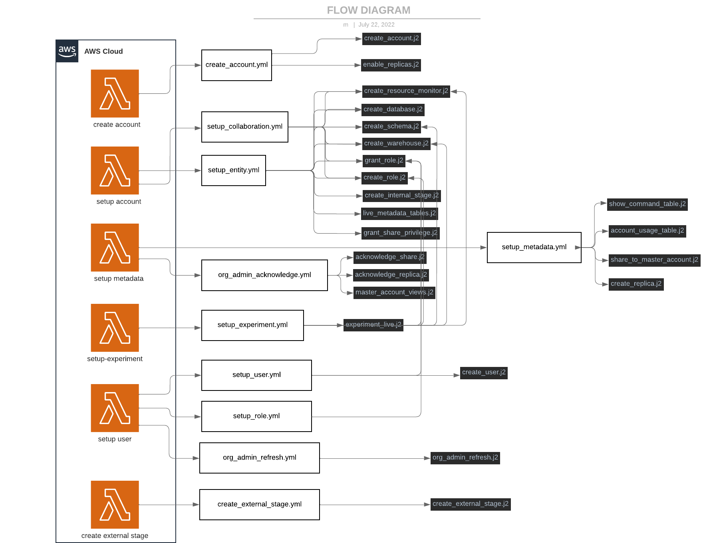

Packages
========

The packages folder consists of tasks and template folder.
These 2 folders help us define how we structure elements and implement architecture using flows. 

Tasks
-----

The tasks folder holds small jinja files that form the foundation for the templates, these tasks require variables which are provided via the templates. 
The tasks are looking at individual objects within snowflake and how we would like to create them, the tasks allow us to create snowflake objects in a standard format based on how the business would like to create the objects or on recommended snowflake best practices.

For example: we would like to have comments when we create any snowflake object so the script in the task has a comment variable which is mandatory.

Templates
---------

Templates folder also contains jinja files, however, these files are designed to arrange tasks in a specific order to build environments or perform specific tasks in snowflake.

The template jinja files also require variables that are provided by service now but they contain variables used by tasks based on business rules, in this manner we ensure naming conventions are adhered to and tasks are run in a specific order in order to take into account any dependencies that we may need to take into account

How it all fits together
------------------------

The overall architecture can be understood using following schema:

1) ServiceNow triggers ``Lambda functions``
2) Lambda functions generate ``yaml templates`` (in white rectangles)
3) Templates define variables and execution order of the ``tasks`` (in black rectangles)

