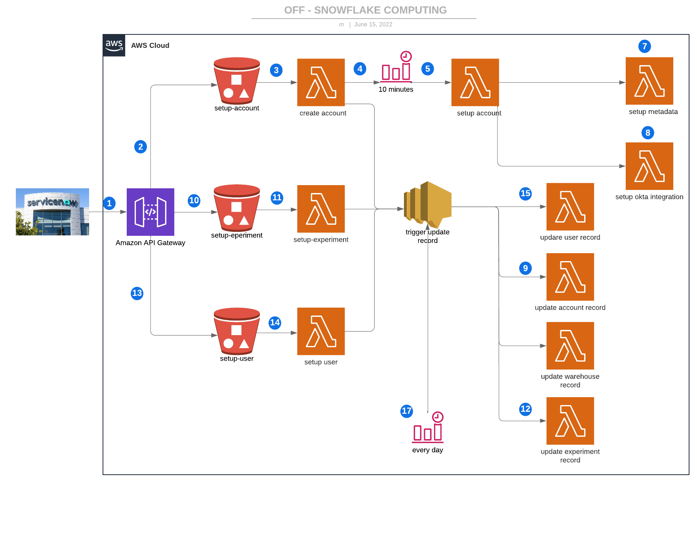
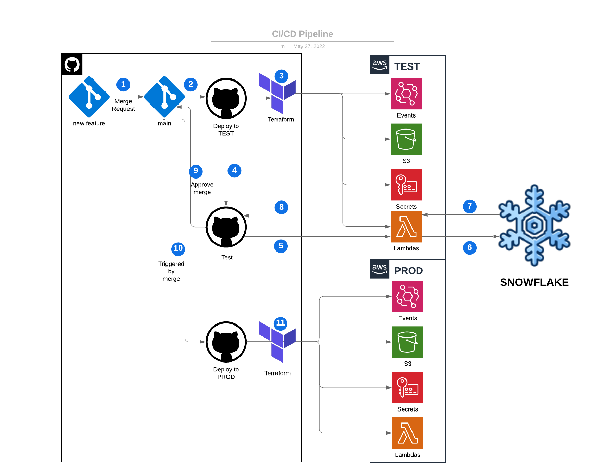

Off-snowflake computing
=======================

This section briefly describes ``off-snowflake computing`` pipeline. Every lambda function performs operations on Snowflake, which is not graphically represented.

1) ServiceNow (and optionally other configuration management service) POST json input onto **Amazon API Gateway**
2) If the POST is on **account** endpoint, file is forwarded to ``setup-account`` bucket.
3) ``create account`` lambda function is triggered. 
4) Lambda function creates new account and schedules ``setup account`` function. Note:\ ``setup account`` cannot be invoked immediately, because provisioning URL for new account takes several minutes.
5) In 10 minutes, ``setup account`` is invoked.
6) When the ``setup account`` succeeds, scheduler is deleted, and **three** other lambda functions are invoked.
7) ``setup metadata`` runs SQL scripts to build account usage, information schema, show command tables in METADATA_DB database of account created above. Then, it creates stored procedures to update metadata on a regular basis and share or replicate to org_admin snowflake account. After that, login to org_admin account to create new database from share or replica and recreate views (include new share_in_db).
8) ``setup okta integration`` create new SAML app in Okta, and configure integration on both Snowflake and Okta side.
9) ``update account records`` collects all the account records from main ``organization account`` and updates relevant tables in ServiceNow.
10) If the POST is on **experiment** endpoint, file is forwarded to ``setup-experiment`` bucket.
11) ``setup experiment`` lambda function is triggered. Lambda setups new experiment in corresponding ``collaboration account``.
12) ``update experiment records`` lambda is triggered. It collects lists of all experiment records from main ``organization account`` in Snowflake, and updates relevant tables in ServiceNow.
13) If the POST is on **user** endpoint, file is forwarded to ``setup-experiment`` bucket.
14) ``setup user`` lambda function is triggered. Based on the required action, user is either create, modified or deleted.
15) When ``setup user`` succeeds, lambda function ``update user records`` is invoke.
16) ``update user records`` collects all user records from Snowflake, and updates relevant tables in ServiceNow.
17) All ``update records`` functions are also scheduled to run once a day, to get changes that were performed directly in Snowflake.

Repository
----------

This repository consists of following modules:

1) `.github/workflows <.github/workflows/>`_ contains CI/CD pipelines for **TEST** and **PROD** environments.
2) `flows <flows/README.rst>`_ is the python package developed by Infinite Lambda, and it is the core part of the off-snowflake computing.
3) `packages <packages/>`_ contains templates that ``flows`` transform into SQL scripts.
4) `lambda <lambda/>`_ contains source code for lambda functions. Lambda function build the SQL scripts using ``flows`` and run them against Snowflake.
5) `test <test/>`_ package contains acceptance tests that approve CI/CD pipeline.
6) `shared <shared/>`_ package contains shared modules used by lambda functions and testing package.
7) `terraform <terraform/README.md>`_ contains terraform configuration files.

CI/CD Pipeline
--------------

1) The merge request of ``feature`` branch to ``main`` triggers `TEST <.github/workflows/test.yml>`_ pipeline.
2) In the first stage , ``terraform apply`` builds lambda functions and deploy all the resources to TEST environment in AWS.
3) In the second stage, tests from ``test`` package run against Snowflake test accounts.
4) If all the tests pass successfully, merge request is approved.
5) Merge of the ``feature`` branch into ``main`` triggers `PROD <.github/workflows/prod.yml>`_ pipeline.
6) `PROD <.github/workflows/prod.yml>`_ contains only deploy stage.
7) ``terraform apply`` runs against AWS production environment and deploys new features into production.
